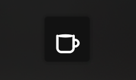
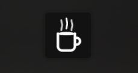

# Caffeine Panel Icon

A lightweight, non-intrusive panel widget for KDE Plasma 6 that prevents system suspension with subtle activity simulation.


## Features

- **Simple Toggle**: Click to enable/disable suspension prevention
- **Visual Feedback**: Coffee cup icon changes to show steam when active
- **Theme Adaptive**: White icons perfect for dark themes
- **Clear Notifications**: Shows system status with user-friendly messages
- **Lightweight**: Minimal resource usage
- **Safe**: No aggressive process killing or system modifications. Uses subtle X11 queries every 3 minutes.

## Screenshots

- **Inactive State**: Simple coffee cup (system can suspend normally)



- **Active State**: Coffee cup with steam (system suspension blocked)




## Quick Install

Run our automatic installer:

```bash
curl -fsSL https://raw.githubusercontent.com/JesusF10/caffeine-panel-icon/main/install.sh | bash
```

Or download and run manually:

```bash
wget https://github.com/JesusF10/caffeine-panel-icon/archive/main.zip
unzip caffeine-panel-icon-main.zip
cd caffeine-panel-icon-main
./install.sh
```

## Manual Installation

### Prerequisites

- KDE Plasma 6.0 or higher
- `kpackagetool6` (usually included with Plasma)
- `xset` (usually pre-installed)

### Steps

1. **Clone the repository:**
   ```bash
   git clone https://github.com/JesusF10/caffeine-panel-icon.git
   cd caffeine-panel-icon
   ```

2. **Install the widget:**
   ```bash
   kpackagetool6 --install . --type Plasma/Applet
   ```

3. **Add to your panel:**
   - Right-click on your panel
   - Select "Add or Manage Widgets..."
   - Search for "Caffeine Panel Icon"
   - Drag it to your panel

## How It Works

The widget uses a gentle approach to prevent system suspension. When you click the widget, it starts a background script. The script runs `xset q` every 3 minutes, which is seen as user activity by the system, keeping it awake without any visible interference.

## Usage

1. **Enable**: Click the coffee cup icon - it will show steam and display "System suspension blocked"
2. **Disable**: Click again - steam disappears and shows "System can suspend normally"
3. **Status**: The icon clearly shows current state at a glance


## Uninstallation

To remove the widget:

```bash
kpackagetool6 --remove caffeine-panel-icon --type Plasma/Applet
```

## Troubleshooting

### Widget doesn't appear in the list
- Make sure you're using Plasma 6.0+
- Try restarting Plasma: `killall plasmashell && kstart plasmashell`

### Widget shows but doesn't work
- Check if `xset` is installed: `which xset`
- Verify script permissions: `ls -la ~/.local/share/plasma/plasmoids/caffeine-panel-icon/contents/code/`

### System still suspends
- The widget only prevents automatic suspension, not manual suspend
- Check your power settings haven't overridden the prevention

## Contributing
If you'd like to contribute, I'd love your help!
It would be great to implement new features like custom automatic suspension schedules or a pomodoro timer.

## Acknowledgments

- Inspired by the original Caffeine application
- Built for the amazing KDE Plasma desktop environment
- Icons designed with simplicity and clarity in mind

---

**Made with care for the KDE community**
